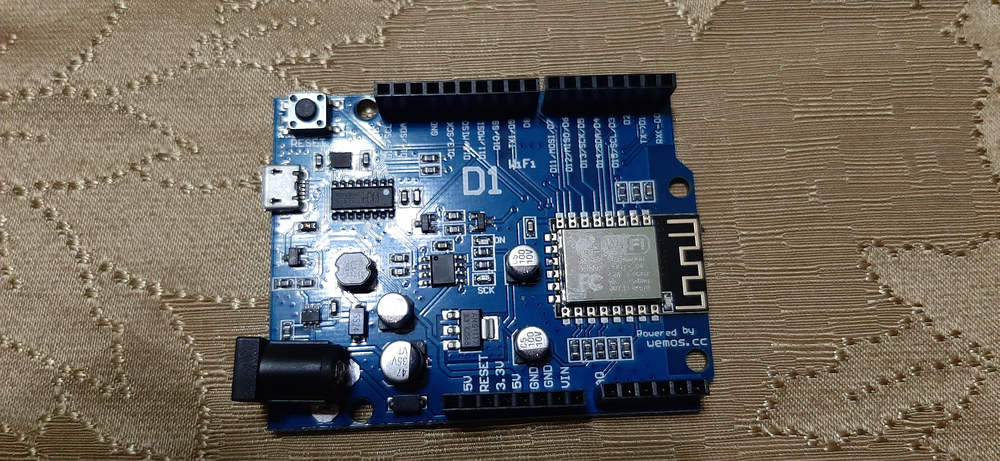
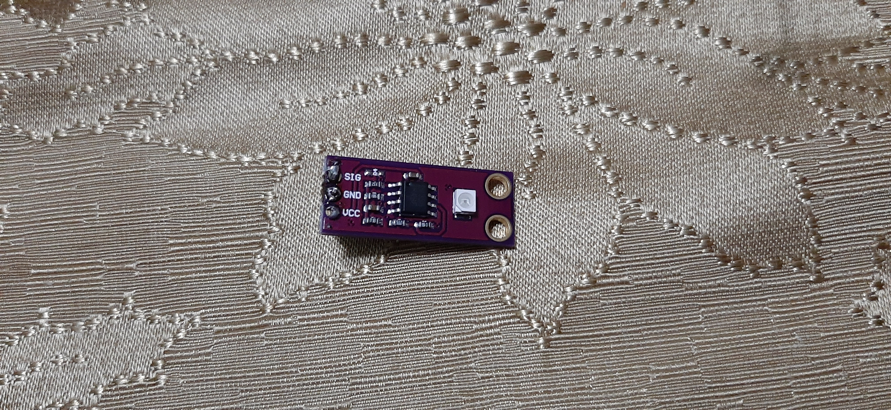
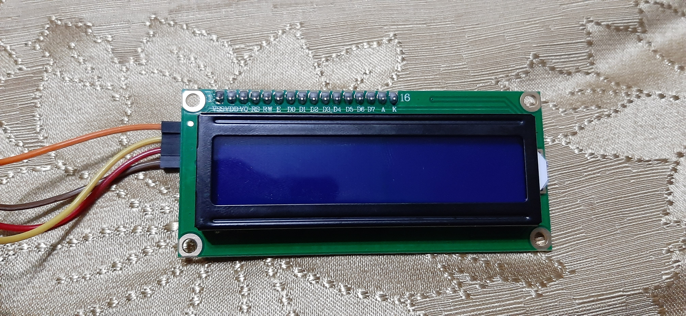
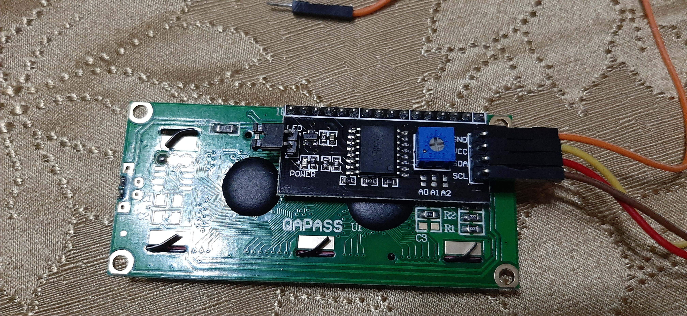
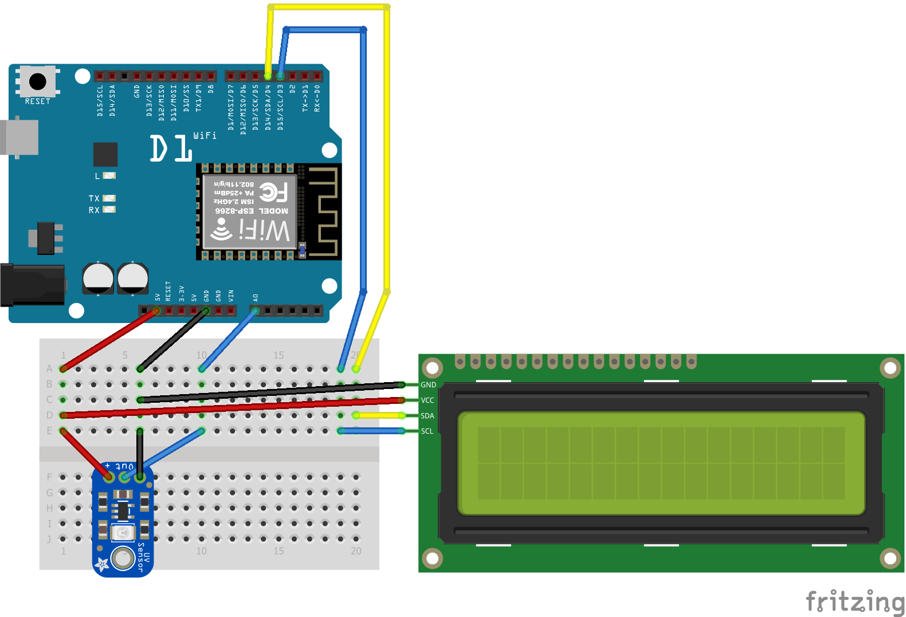
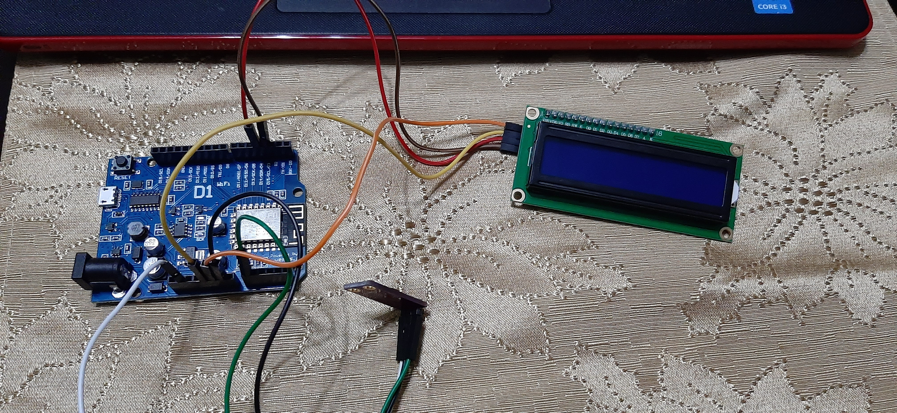

# Mini Estacion Meteorologica (con sensor de luz GUVA-S12D)    
  
## :fa-play: **Inicio**    
 
### :fa-users: Integrantes    
   
#### &nbsp;&nbsp;&nbsp;&nbsp;    Andy Escobar - 21611024    
#### &nbsp;&nbsp;&nbsp;&nbsp;    Ivan Carcamo - 21611288    
#### &nbsp;&nbsp;&nbsp;&nbsp;    Luis Ponce   - 21711234    
#### &nbsp;&nbsp;&nbsp;&nbsp;    Mario Flores - 21711252    
 
### :fa-info-circle: **Introducción**     
  
&nbsp;&nbsp; El siguiente informe da detalles de como se implementó un sistema simple que da información acerda de la luminosidad del ambiente.      
  
&nbsp;&nbsp; Con el avance  de la tecnología y desarrollo  de nuevos los sensores  podemos realizas diversas dispositivos que nos ayuden de una manera precisa y automatizada para obtener datos, como por ejemplo la temparatura en lugar, la condiciones de luz en ambiente, la humedad en una superficie. Y gracias a estos podemos hacer uso del internet que da paso al **IoT** (*Internet Of Things / Español: Internet de la Cosas*), ya que nos proporciona grandes ventajas como ver los datos de nuestros dispositivos en cualquier lugar en que estemos siempre y cuando obtengamos acceso a internet.     
&nbsp;     
&nbsp;&nbsp; Acontinuacion estaremos mostrando el desarrollo de un dispositivos que es capaz de detectar la intensida de luz en un ambiente y por medio de un modulo Wi-Fi en el circuito trasmitirlo atravez de internet en una pagina web, demostrando asi un ejemplo aplicable para el **Internet de las Cosas**.   
 
### :fa-bullseye: **Objetivos**    
  
&nbsp;&nbsp; - Implementar un circuito con un **sensor de luz** usando el microcontrolador **Arduino Uno** capaz de leer la intensida de luz que recibe.     
 
&nbsp;&nbsp; - Implementar el **sensor de Wi-Fi** en el circuito para que este envie la información atravez de internet  

&nbsp;&nbsp;  
&nbsp;&nbsp;  
  
## :fa-forward: **Contenido**     
  
##### Circuito Electronico:     
&nbsp; &nbsp; Es una combinación de componentes conectados entre sí, de manera que proporcionen una o más trayectorias cerradas que permitan la circulación de la corriente y el aprovechamiento de ésta para la realización de un trabajo útil.    
  
##### Sensor:   
  
&nbsp; &nbsp; Es un dispositivo o componente electrónico que está capacitado para detectar acciones o estímulos externos y responder en consecuencia. Estos aparatos pueden transformar las magnitudes físicas o químicas en magnitudes eléctricas.   
  
##### Microcontrolador:   
  
&nbsp; &nbsp; Un microcontrolador es un circuito integrado que en su interior contiene una unidad central de procesamiento (CPU), unidades de memoria (RAM y ROM), puertos de entrada y salida y periféricos.    
  
##### Arduino:   
 
&nbsp; &nbsp; Es una plataforma de creación de electrónica de código abierto, la cual está basada en hardware y software libre, flexible y fácil de utilizar para los creadores y desarrolladores. Esta plataforma permite crear diferentes tipos de microordenadores de una sola placa a los que la comunidad de creadores puede darles diferentes tipos de uso.     
  
##### Arduino IDE:   
  
&nbsp; &nbsp; Es una aplicacion multiplataforma que se utiliza para escribir y cargar programas en placas compatibles con Arduino. Admite los lenguajes C y C ++ utilizando reglas especiales de estructuración de códigos.   
  
###  **I. :fa-save: Software**      
 
#### :fa-plug: Driver   
  
&nbsp; &nbsp; Los drivers para utiliar Arduino vienen incluidos en el IDE de [**Arduino**](https://www.arduino.cc/en/Guide/windows)
  
#### :fa-laptop: IDE   
  
&nbsp; &nbsp; Se utilizó el [**Arduino IDE**](https://www.arduino.cc/en/Main/Software)   
 
#### :fa-object-group: Diseño   
  
  &nbsp; &nbsp; Para el diseño o prototipo digital del dispositvo se  utilizó la herramienta [**Fritzing-Portable**](https://sourceforge.net/projects/fritzing-portable/)   
 
#### :fa-search: Sensor

&nbsp; &nbsp; Para el sensor de luz, no se utilizó una libreria.
 
#### :fa-tv: Pantalla (Display LCD)

&nbsp; &nbsp; Las libreria usada para el display fue [**Liquid Crystal**](https://www.arduino.cc/en/Reference/LiquidCrystal)
 
#### :fa-wifi: Internet (Wifi)

&nbsp; &nbsp; El arduino WeMos D1 ya viene integrado con un módulo WiFi. La libreria a usar es [**ESP8266WIFI**](https://arduino-esp8266.readthedocs.io/en/latest/esp8266wifi/readme.html)
 
### **II. :fa-microchip: Hardware**
 
####  :fa-microchip: Microcontrolador

##### Arduino WeMos D1:

 

> Se puede conseguir en [Amazon](https://www.amazon.com/BephaMart-ESP8266-Development-Compatible-Arduino/dp/B01BAL1IGW)
  
#### :fa-search: Sensor

##### Sensor UV S12SD

 

> Comprado en [Think Making](https://thinkmaking.org/shop/sensor-de-luz-ultravioleta-guva-s12d/)

#### :fa-tv: Pantalla (Display LCD)

##### LCD 1602 + I2C

  
  

> Comprado en [Think Making](https://thinkmaking.org/shop/pantalla-lcd-1602-i2c/)

### **III. :fa-object-group: Diseño**     
  
#### :fa-microchip: Pinout de Microcontrolador / Mapeo de pines

| Arduino    | LCD | Sensor |
|:----------:|:---:|:------:|
| D14/SDA/D4 | SDA |        |
| D15/SDL/D3 | SCL |   $12  |
| 5V         | VCC |   VCC  |
| GND        | GND |   GND  |
| A0         |     |   OUT  |
  
#### :fa-paint-brush: Diseño en Fritzing del proyecto

 
 
###  **IV. :fa-code: Desarrollo**   
 
#### :fa-microchip: Instalación de Tarjeta (Arduino)      
 
#### :fa-book: Instalación de Libreria(s)   
  
##### :fa-search: Sensor   
  
##### :fa-tv: Pantalla (Display LCD)   
  
##### :fa-wifi: Internet (Wifi)    
  
#### :fa-code: Código de proyecto     
```c 
#include <ESP8266HTTPClient.h>  
#include <ESP8266WiFi.h>  
#include <LiquidCrystal_I2C.h>  
  
int sensorPin = A0;    // Pin de entrada del sensor  
int sensorValue = 0;  // valor que capta el sensor  
const char *port = "192.168.1.1"; // ip del default gateway  
const char* url = "http://jsonplaceholder.typicode.com/users";  
const char* id = "AndroidAP0D29"; // nombre de la red  
const char* pass = "hola12345"; // password  
  
int contador = 0; // verifica si tarda mucho en conectarse a la red  
LiquidCrystal_I2C lcd(0x27,16,2); // si no te sale con esta direccion  puedes usar (0x3f,16,2) || (0x27,16,2)  ||(0x20,16,2)   
  
void setup() {  
  Serial.begin(115200);  
  inicializarLCD();  
  incializarWifi();  
  lcd.clear();  
  EscribirLcdFila1("Conexion");  
  EscribirLcdFila2("Establecida");  
  delay(3000);  
  pinMode(sensorPin, INPUT);  
}  
  
void loop() {  
    // toma el valor del sensor y lo asigna a sensorValue  
    lcd.clear();  
    sensorValue = analogRead(sensorPin);  
  
    // lo escribe en el LCD  
    EscribirLcdFila1("Lumenes: "+ String(sensorValue));  
    delay(3000); // espera 3 segundos hasta que haga el post  
    lcd.clear();  
  
    // hace el post  
    hacerPost(String(sensorValue));  
    lcd.clear();  
    EscribirLcdFila1("Espere 10");  
    EscribirLcdFila2("Segundos...");  
    delay(10000); // 10 segundos para hacer otro post  
}  
  
void EscribirLcdFila1(String texto){  
  lcd.setCursor(0,0);  
  lcd.print(texto);  
  delay(100);  
}  
  
void EscribirLcdFila2(String texto){  
  lcd.setCursor(0,1);  
  lcd.print(texto);  
  delay(100);  
}  
  
void inicializarLCD(){  
  lcd.init();  
  lcd.backlight();  
}  
  
void incializarWifi(){  
  WiFi.mode(WIFI_OFF);  
  WiFi.begin(id,pass);  
  WiFi.mode(WIFI_STA);  
  
  while((WiFi.status() != WL_CONNECTED)){  
     delay(1000); // 1 segundo  
     EscribirLcdFila1("Esperando");  
     EscribirLcdFila2("Conexion");  
     lcd.clear();  
     contador++;
     
     if(contador >=10){  
        break;  
     }  
  }  
}  
  
void hacerPost(String sensor){  
  if(WiFi.status()== WL_CONNECTED){  
    delay(1000);  
    HTTPClient http;  
    http.begin(port);  
    http.begin(url);  
    http.addHeader("Content-Type", "text/plain");  
    int httpCode = http.POST(sensor);  
    lcd.clear();  
    EscribirLcdFila1("Respuesta: ");  
    if(httpCode == 201){ EscribirLcdFila2("OK");}else{EscribirLcdFila2("BAD REQ");}  
    delay(3000);  
    http.end();  
  }else{  
    while(WiFi.status()!= WL_CONNECTED){  
     lcd.clear();  
     EscribirLcdFila1("Esperando");  
     EscribirLcdFila2("Conexion");  
     delay(100);  
    }  
  }  
}  
``` 
 
### **V. :fa-check: Funcionalidad**   
  
#### :fa-film: Demostración (Video)
El video demostrativo se puede ver en [**Youtube**](https://youtu.be/AB2dkN5RNro)
   
#### :fa-camera: Despliegue en pantalla (Imagen)     
   
#### :fa-camera: Envío  a servidor (Imagen)    
   
#### :fa-camera: Todos los componentes del proyecto



## :fa-step-forward: **Fin**

### &nbsp;&nbsp; :fa-check-circle: Conclusiones

### &nbsp;&nbsp; :fa-external-link: Referencias 

 
