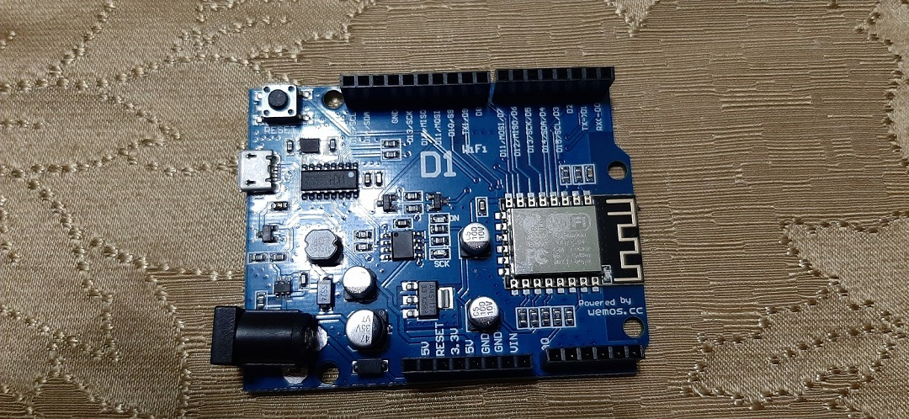

# Mini Estacion Meteorológica (con sensor de luz GUVA-S12D)    
---
## :radio_button: **Inicio**    
---

###  Integrantes    
   
#### &nbsp;&nbsp;&nbsp;&nbsp;    Andy Escobar - 21611024    
#### &nbsp;&nbsp;&nbsp;&nbsp;    Iván Carcamo - 21611288  
#### &nbsp;&nbsp;&nbsp;&nbsp;    Luis Ponce   - 21711234    
#### &nbsp;&nbsp;&nbsp;&nbsp;    Mario Flores - 21711252    
&nbsp;&nbsp;

---
### :large_blue_diamond: **Introducción**     
---
&nbsp;&nbsp; Con el avance  de la tecnología y desarrollo  de nuevos los sensores  podemos realizas diversas dispositivos que nos ayuden de una manera precisa y automatizada para obtener datos, como por ejemplo la temparatura en lugar, la condiciones de luz en ambiente, la humedad en una superficie. Y gracias a estos podemos hacer uso del internet que da paso al **IoT** (*Internet Of Things / Español: Internet de la Cosas*), ya que nos proporciona grandes ventajas como ver los datos de nuestros dispositivos en cualquier lugar en que estemos siempre y cuando obtengamos acceso a internet.   
&nbsp;  

--- 
&nbsp;&nbsp; A continuación estaremos mostrando el desarrollo de un dispositivos que es capaz de detectar la intensida de luz en un ambiente y atravez de un módulo Wi-Fi en el circuito trasmitirlo a travez de internet en una página web, demostrando asi un ejemplo aplicable para el **Internet de las Cosas**. 

 ---
### :large_blue_diamond: **Objetivos**    
  
&nbsp;&nbsp; - Implementar un circuito con un **sensor de luz** usando el microcontrolador **Arduino Uno** capaz de leer la intensida de luz que recibe.     
 
&nbsp;&nbsp; - Implementar el **sensor de Wi-Fi** en el circuito para que este envie la información atravez de internet.
&nbsp;&nbsp; - Comprender el principio del Intenet de las Cosas al enviar la información recolectado por el dispositivo a internet.

&nbsp;&nbsp;  
&nbsp;&nbsp; 

 --- 
  
## :radio_button: **Contenido**     

---  

###  **I. :large_blue_diamond: Software**      
---
#### :black_circle: Driver   
  
&nbsp; &nbsp; Los drivers para utiliar Arduino vienen incluidos en el IDE de [**Arduino**](https://www.arduino.cc/en/Guide/windows)
  
#### :black_circle: IDE   
  
&nbsp; &nbsp; Se utilizó el [**Arduino IDE**](https://www.arduino.cc/en/Main/Software)   
###### &nbsp; &nbsp;  Arduino IDE:   
&nbsp; &nbsp; Es una aplicacion multiplataforma que se utiliza para escribir y cargar programas en placas compatibles con Arduino. Admite los lenguajes C y C++ utilizando reglas especiales de estructuración de códigos.   
 
 ---

#### :black_circle: Diseño   
  
  &nbsp; &nbsp; Para el diseño o prototipo digital del dispositvo se  utilizó la herramienta **[Fritzing-Portable](https://sourceforge.net/projects/fritzing-portable/)**   
 
#### :black_circle: Sensor

&nbsp; &nbsp; Para el sensor de luz, no se utilizó una libreria.
 
#### :black_circle: Pantalla (Display LCD)

&nbsp; &nbsp; Las libreria usada para el display fue **[Liquid Crystal](https://www.arduino.cc/en/Reference/LiquidCrystal)**
 
#### :black_circle: Internet (Wifi)

&nbsp; &nbsp; El arduino WeMos D1 ya viene integrado con un módulo WiFi. La libreria a usar es [**ESP8266WIFI**](https://arduino-esp8266.readthedocs.io/en/latest/esp8266wifi/readme.html)

--- 
### **II. :large_blue_diamond: Hardware**
---
####  :black_circle: Microcontrolador

###### &nbsp; Microcontrolador:   
  
&nbsp; &nbsp; Un microcontrolador es un circuito integrado que en su interior contiene una unidad central de procesamiento (CPU), unidades de memoria (RAM y ROM), puertos de entrada y salida y periféricos.    
  
---
##### Arduino WeMos D1:

 
> Se puede conseguir en [Amazon](https://www.amazon.com/BephaMart-ESP8266-Development-Compatible-Arduino/dp/B01BAL1IGW)

---
#### :black_circle: Sensor
##### Sensor UV S12SD
 
> Comprado en [Think Making](https://thinkmaking.org/shop/sensor-de-luz-ultravioleta-guva-s12d/)

---

#### :black_circle: Pantalla (Display LCD)

##### LCD 1602 + I2C

  

---
  

> Comprado en [Think Making](https://thinkmaking.org/shop/pantalla-lcd-1602-i2c/)

---


### **III. :large_blue_diamond: Diseño**     
---  
#### :black_circle: Pinout de Microcontrolador / Mapeo de pines


---
| Arduino    | LCD | Sensor |
|:----------:|:---:|:------:|
| D14/SDA/D4 | SDA |        |
| D15/SDL/D3 | SCL |   $12  |
| 5V         | VCC |   VCC  |
| GND        | GND |   GND  |
| A0         |     |   OUT  |

---
  
#### :black_circle: Diseño en Fritzing del proyecto

 

 ---
 
###  **IV. :large_blue_diamond: Desarrollo**   
 
 ---
#### :black_circle: Instalación de Tarjeta (Arduino)  

&nbsp; &nbsp; En nuestro caso, no hubo necesidad de instalar una placa extra a nuestro arduino, solamente los componentes previamente listados (LCD, sensor) 

---

#### :black_circle: Instalación de Libreria(s)    

##### :small_orange_diamond: Sensor    

&nbsp; &nbsp; No fue requerida una libreria para el sensor, el sensor simplemente enviaba una señal de entrada analoga a nuestro arduino 

---
##### :small_orange_diamond: Pantalla (Display LCD)   

&nbsp; &nbsp; Para poder utilizar el LCD, fue necesario descargar una libreria afuera del arduino IDE. Se siguieron los mismos [***pasos de instalacion de la pagina oficial del creador de la libreria "Arduino-LiquidCrystal-I2C-library"***](https://github.com/fdebrabander/Arduino-LiquidCrystal-I2C-library/blob/master/README.md), la cual terminamos integrando a nuestro proyecto. 


---
### :large_blue_diamond: Internet (Wifi) 

&nbsp; &nbsp; Para la instalacion de las librerias del Wifi (libreria [***ESP8266HTTPClient***](https://github.com/esp8266/Arduino/tree/master/libraries/ESP8266HTTPClient) y [***ESP8266WiFi***](https://github.com/esp8266/Arduino/tree/master/libraries/ESP8266WiFi)), simplemente fue cuestion de añadirla al proyecto ya que estas dos librerias ya vienen incluidas en las librerias que vienen con el arduino IDE.    
  
  ---
#### :black_circle: Código de proyecto     
```cpp 
#include <ESP8266HTTPClient.h>  
#include <ESP8266WiFi.h>  
#include <LiquidCrystal_I2C.h>  
  
int sensorPin = A0;    // Pin de entrada del sensor  
int sensorValue = 0;  // valor que capta el sensor  
const char *port = "192.168.1.1"; // ip del default gateway  
const char* url = "http://jsonplaceholder.typicode.com/users";  
const char* id = "AndroidAP0D29"; // nombre de la red  
const char* pass = "hola12345"; // password  
  
int contador = 0; // verifica si tarda mucho en conectarse a la red  
LiquidCrystal_I2C lcd(0x27,16,2); // si no te sale con esta direccion  puedes usar (0x3f,16,2) || (0x27,16,2)  ||(0x20,16,2)   
  
void setup() {  
  Serial.begin(115200);  
  inicializarLCD();  
  incializarWifi();  
  lcd.clear();  
  EscribirLcdFila1("Conexion");  
  EscribirLcdFila2("Establecida");  
  delay(3000);  
  pinMode(sensorPin, INPUT);  
}  
  
void loop() {  
    // toma el valor del sensor y lo asigna a sensorValue  
    lcd.clear();  
    sensorValue = analogRead(sensorPin);  
  
    // lo escribe en el LCD  
    EscribirLcdFila1("Lumenes: "+ String(sensorValue));  
    delay(3000); // espera 3 segundos hasta que haga el post  
    lcd.clear();  
  
    // hace el post  
    hacerPost(String(sensorValue));  
    lcd.clear();  
    EscribirLcdFila1("Espere 10");  
    EscribirLcdFila2("Segundos...");  
    delay(10000); // 10 segundos para hacer otro post  
}  
  
void EscribirLcdFila1(String texto){  
  lcd.setCursor(0,0);  
  lcd.print(texto);  
  delay(100);  
}  
  
void EscribirLcdFila2(String texto){  
  lcd.setCursor(0,1);  
  lcd.print(texto);  
  delay(100);  
}  
  
void inicializarLCD(){  
  lcd.init();  
  lcd.backlight();  
}  
  
void incializarWifi(){  
  WiFi.mode(WIFI_OFF);  
  WiFi.begin(id,pass);  
  WiFi.mode(WIFI_STA);  
  
  while((WiFi.status() != WL_CONNECTED)){  
     delay(1000); // 1 segundo  
     EscribirLcdFila1("Esperando");  
     EscribirLcdFila2("Conexion");  
     lcd.clear();  
     contador++;
     
     if(contador >=10){  
        break;  
     }  
  }  
}  
  
void hacerPost(String sensor){  
  if(WiFi.status()== WL_CONNECTED){  
    delay(1000);  
    HTTPClient http;  
    http.begin(port);  
    http.begin(url);  
    http.addHeader("Content-Type", "text/plain");  
    int httpCode = http.POST(sensor);  
    lcd.clear();  
    EscribirLcdFila1("Respuesta: ");  
    if(httpCode == 201){ EscribirLcdFila2("OK");}else{EscribirLcdFila2("BAD REQ");}  
    delay(3000);  
    http.end();  
  }else{  
    while(WiFi.status()!= WL_CONNECTED){  
     lcd.clear();  
     EscribirLcdFila1("Esperando");  
     EscribirLcdFila2("Conexion");  
     delay(100);  
    }  
  }  
}  
``` 
---
```cpp
#include <ESP8266HTTPClient.h>  
#include <ESP8266WiFi.h>  
#include <LiquidCrystal_I2C.h>  
  
int sensorPin = A0;    // Pin de entrada del sensor  
int sensorValue = 0;  // valor que capta el sensor  
const char *port = "192.168.1.1"; // ip del default gateway  
const char* url = "http://jsonplaceholder.typicode.com/users";  
const char* id = "AndroidAP0D29"; // nombre de la red  
const char* pass = "hola12345"; // password  
  
int contador = 0; // verifica si tarda mucho en conectarse a la red  
LiquidCrystal_I2C lcd(0x27,16,2); // si no te sale con esta direccion  puedes usar (0x3f,16,2) || (0x27,16,2)  ||(0x20,16,2)   
  
void setup() {  
  Serial.begin(115200);  
  inicializarLCD();  
  incializarWifi();  
  lcd.clear();  
  EscribirLcdFila1("Conexion");  
  EscribirLcdFila2("Establecida");  
  delay(3000);  
  pinMode(sensorPin, INPUT);  
}  
  
void loop() {  
    // toma el valor del sensor y lo asigna a sensorValue  
    lcd.clear();  
    sensorValue = analogRead(sensorPin);  
  
    // lo escribe en el LCD  
    EscribirLcdFila1("Lumenes: "+ String(sensorValue));  
    delay(3000); // espera 3 segundos hasta que haga el post  
    lcd.clear();  
  
    // hace el post  
    hacerPost(String(sensorValue));  
    lcd.clear();  
    EscribirLcdFila1("Espere 10");  
    EscribirLcdFila2("Segundos...");  
    delay(10000); // 10 segundos para hacer otro post  
}  

```
---
```cpp
void EscribirLcdFila1(String texto){  
  lcd.setCursor(0,0);  
  lcd.print(texto);  
  delay(100);  
}  
  
void EscribirLcdFila2(String texto){  
  lcd.setCursor(0,1);  
  lcd.print(texto);  
  delay(100);  
}  
  
void inicializarLCD(){  
  lcd.init();  
  lcd.backlight();  
}  
  
```
---
```cpp
void incializarWifi(){  
  WiFi.mode(WIFI_OFF);  
  WiFi.begin(id,pass);  
  WiFi.mode(WIFI_STA);  
  
  while((WiFi.status() != WL_CONNECTED)){  
     delay(1000); // 1 segundo  
     EscribirLcdFila1("Esperando");  
     EscribirLcdFila2("Conexion");  
     lcd.clear();  
     contador++;
     
     if(contador >=10){  
        break;  
     }  
  }  
} 
```
---

```cpp
void hacerPost(String sensor){  
  if(WiFi.status()== WL_CONNECTED){  
    delay(1000);  
    HTTPClient http;  
    http.begin(port);  
    http.begin(url);  
    http.addHeader("Content-Type", "text/plain");  
    int httpCode = http.POST(sensor);  
    lcd.clear();  
    EscribirLcdFila1("Respuesta: ");  
    if(httpCode == 201){ EscribirLcdFila2("OK");}else{EscribirLcdFila2("BAD REQ");}  
    delay(3000);  
    http.end();  
  }else{  
    while(WiFi.status()!= WL_CONNECTED){  
     lcd.clear();  
     EscribirLcdFila1("Esperando");  
     EscribirLcdFila2("Conexion");  
     delay(100);  
    }  
  }  
} 
```
---
### **V. :large_blue_diamond: Funcionalidad**   
--- 
#### :black_circle: Demostración (Video)

[](https://youtu.be/AB2dkN5RNro)

---
   
#### :black_circle: Despliegue en pantalla     
   

---
#### :black_circle: Envío  a servidor  
   

---
#### :black_circle: Todos los componentes del proyecto


---
## :radio_button: **Fin**

---

### &nbsp;&nbsp; :large_blue_diamond: Conclusiones


##### &nbsp; &nbsp; &nbsp; :heavy_check_mark: El Internet de las Cosas se plantea como una tecnología de enorme utilidad a la hora de mejorar la eficiencia de los dispositivos.

##### &nbsp; &nbsp; &nbsp; :heavy_check_mark: Apredimos que con Arduino podemos crear un dispositivo que funcione con los principios del  Internet de la Cosas 


##### &nbsp; &nbsp; &nbsp; :heavy_check_mark: Se implementó un circuito capaz de realizar un dispositvo capaz de leer la intensidad de luz en un ambiente.

---

##### &nbsp; &nbsp; &nbsp; :heavy_check_mark: Se logró extraer los datos recolectados por el sensor y enviarlos atravez de internet y que estos sean proyectados en un sitio web.

##### &nbsp; &nbsp; &nbsp; :heavy_check_mark: Aprendimos el uso de un arduino y las infinidades de cosa que un micro controlador puede proporcionar para llevar a cabo la innovación, la creatividad, entre muchas otras cosas.

##### &nbsp; &nbsp; &nbsp; :heavy_check_mark:  Aprendimos a aprovechar de las librerias que ofrece Arduino y tambien a la instalacion de librerias de terceros para llevar a cabo la integracion de componentes que nos ayudaron a desarrollar el proyecto

---


### &nbsp;&nbsp; :large_blue_diamond: Referencias 

#### &nbsp;&nbsp; :link:  **[circuits4you](https://circuits4you.com/2018/03/10/esp8266-nodemcu-post-request-data-to-website/)**

#### &nbsp;&nbsp; :link:  **[Arduino](https://www.arduino.cc/en/Reference/LiquidCrystal)**

#### &nbsp;&nbsp; :link:  **[ESP8266 Learning](http://www.esp8266learning.com/wemos-mini-i2c-lcd-example.php)**

#### &nbsp;&nbsp; :link:  **[ESP8266 Arduino Core](https://arduino-esp8266.readthedocs.io/en/latest/esp8266wifi/readme.html)**

